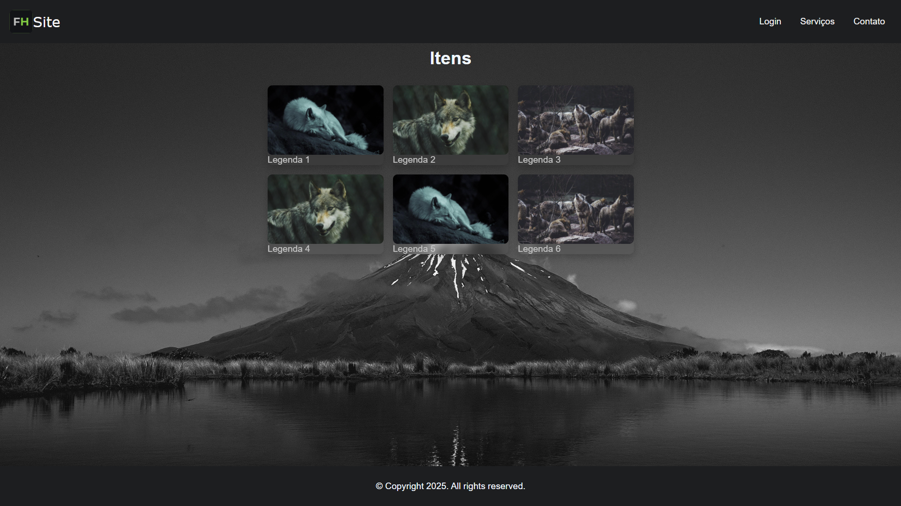
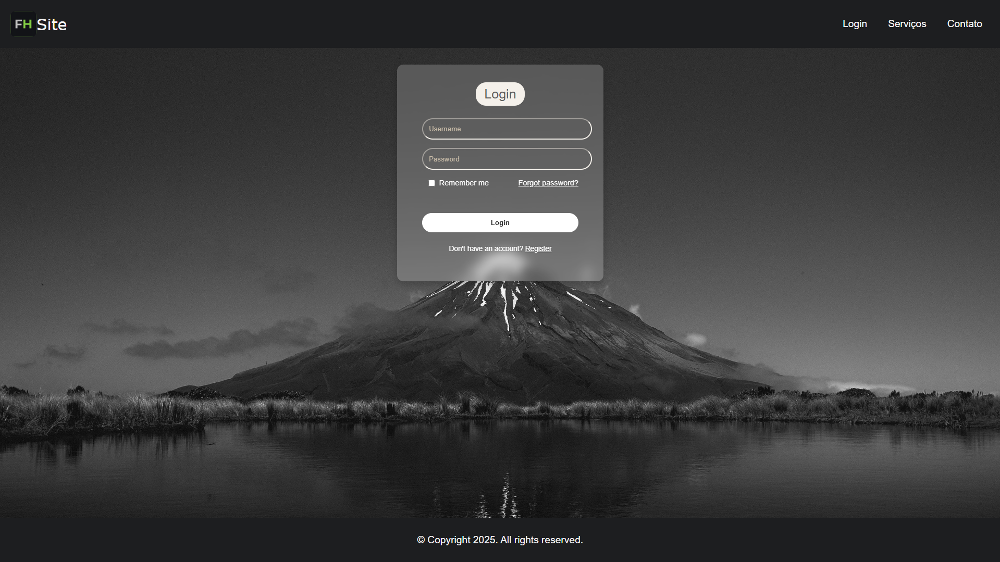

# Simple-Landing-Page

## 📌 Descrição

Este projeto é uma landing page moderna com uma página de login integrada. Foi desenvolvido com foco em responsividade, design clean e boas práticas de front-end. Ideal para ser usado como template inicial ou como demonstração de habilidades em HTML, CSS e JavaScript.

## 🚀 Funcionalidades

- Página inicial com design responsivo
- Página de login
- Validação visual de formulário
- Estilo limpo e escuro
- Adaptável para diferentes resoluções de tela

## 🧰 Tecnologias utilizadas

- HTML5
- CSS3
- JavaScript

## 📷 Preview

### Home

### Login

> Simple Front-End
